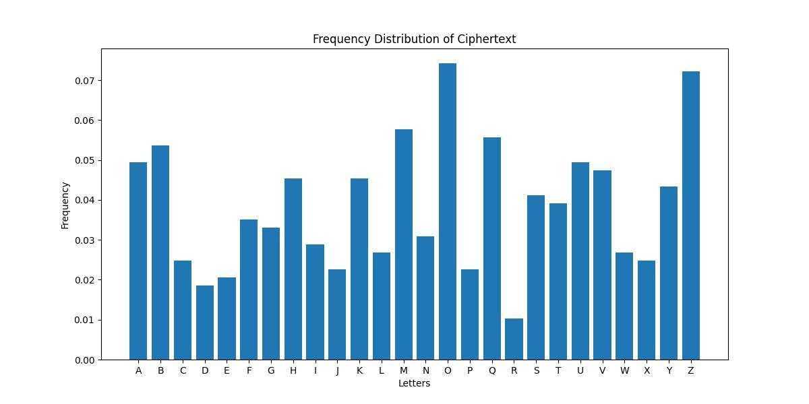

# Vigenère Cipher Encryption and Decryption

This project provides an implementation of the Vigenère cipher for encrypting and decrypting text. It also includes a frequency analysis tool for breaking Vigenère cipher with unknown keys by comparing the letter frequency distribution of the ciphertext to the typical English letter frequency distribution.

## Table of Contents
- [Installation](#installation)
- [Usage](#usage)
- [Project Structure](#project-structure)
- [Vigenère Cipher](#vigenère-cipher)
- [Frequency Analysis](#frequency-analysis)
- [Visualization](#visualization)
- [Contributing](#contributing)
- [License](#license)

## Installation

To run this project, you need to have Python 3.x installed along with the necessary libraries. You can install the required libraries using:

```bash
pip install matplotlib
```

## Usage

1. Clone this repository:
    ```bash
    git clone https://github.com/esmail-sarhadi/Vigen-re-Cipher-Encryption-and-Decryption.git
    ```
2. Navigate to the project directory:
    ```bash
    cd vigenere-cipher
    ```
3. Place your ciphertext in a file named `input.txt` in the project directory.
4. Run the script:
    ```bash
    python vigenere_solver.py < input.txt
    ```

## Project Structure

- `vigenere_solver.py`: Main script containing the code for encryption, decryption, and frequency analysis of the Vigenère cipher.
- `input.txt`: File containing the ciphertext to be decrypted.
- `frequency_distribution.jpg`: Image file showing the frequency distribution of the ciphertext.

## Vigenère Cipher

The Vigenère cipher is a method of encrypting alphabetic text by using a simple form of polyalphabetic substitution. A key is used to shift the letters of the plaintext to produce the ciphertext.

### Encryption

The encryption function takes a plaintext message and a key, and produces a ciphertext by shifting each letter of the plaintext by the corresponding letter in the key.

### Decryption

The decryption function reverses the process, taking a ciphertext and the same key to reproduce the original plaintext.

## Frequency Analysis

The frequency analysis function compares the letter frequency distribution of the ciphertext to the typical English letter frequency distribution to find possible keys for the Vigenère cipher.

## Visualization

The script generates a bar chart of the frequency distribution of the ciphertext letters, saved as `frequency_distribution.jpg`.



## Contributing

Contributions are welcome! Please open an issue or submit a pull request for any changes.

## License

This project is licensed under the MIT License - see the [LICENSE](LICENSE) file for details.


### Description

This project implements the Vigenère cipher for encrypting and decrypting text, along with a frequency analysis tool for breaking the cipher. It includes visualization of the letter frequency distribution, helping in the analysis of the ciphertext to find possible keys.

<a href="https://nowpayments.io/donation?api_key=REWCYVC-A1AMFK3-QNRS663-PKJSBD2&source=lk_donation&medium=referral" target="_blank">
     
    </a>
